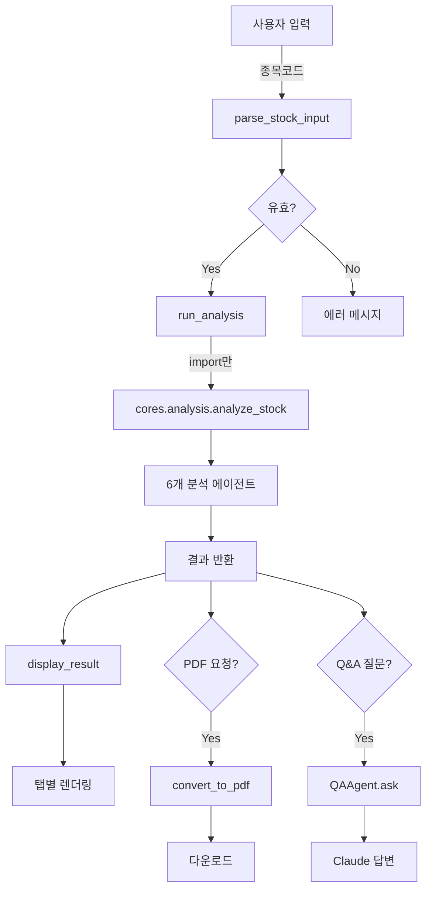

# PRISM-INSIGHT Streamlit - 시스템 아키텍처 설계

## 문서 정보
- **문서 버전**: 1.0.0
- **작성일**: 2025-11-09
- **관련 문서**: PRD-STREAMLIT-STOCK-ANALYZER.md

---

## ⚠️ 설계 철학: 기존 코드 절대 수정 금지

```
━━━━━━━━━━━━━━━━━━━━━━━━━━━━━━━━━━━━━━━━━━━━━
🚨 Golden Rule: DO NOT MODIFY EXISTING CODE 🚨
━━━━━━━━━━━━━━━━━━━━━━━━━━━━━━━━━━━━━━━━━━━━━

이 아키텍처는 다음 원칙을 엄격히 준수합니다:

✅ ALLOWED (허용)
  - 새 파일 생성
  - 기존 모듈 import
  - 기존 함수 호출
  - 새 디렉토리 생성

❌ FORBIDDEN (금지)
  - 기존 파일 수정
  - 기존 함수 시그니처 변경
  - 기존 로직 수정
  - 기존 설정 파일 수정

━━━━━━━━━━━━━━━━━━━━━━━━━━━━━━━━━━━━━━━━━━━━━
```

---

## 1. 아키텍처 개요

### 1.1 설계 원칙

**Adapter Pattern (어댑터 패턴)**
```
┌─────────────────────────────────────────┐
│  새로운 Streamlit 앱                     │
│  (streamlit_apps/personal_analyzer.py)  │
└─────────────────┬───────────────────────┘
                  │
                  │ Adapter Layer
                  │ (import만 사용)
                  │
┌─────────────────▼───────────────────────┐
│  기존 PRISM-INSIGHT 시스템 (수정 금지)   │
│  - cores/analysis.py                    │
│  - cores/agents/*                       │
│  - pdf_converter.py                     │
└─────────────────────────────────────────┘
```

### 1.2 아키텍처 스타일

**3-Tier Architecture (3계층 아키텍처)**

```
┌─────────────────────────────────────────────────────────┐
│  Presentation Layer (프레젠테이션 계층)                  │
│  ┌─────────────────────────────────────────────────┐   │
│  │ Streamlit UI Components                         │   │
│  │ - st.text_input, st.button, st.markdown        │   │
│  └─────────────────────────────────────────────────┘   │
└────────────────┬────────────────────────────────────────┘
                 │
┌────────────────▼────────────────────────────────────────┐
│  Business Logic Layer (비즈니스 로직 계층)               │
│  ┌─────────────────────────────────────────────────┐   │
│  │ Adapter Functions (새로 작성)                    │   │
│  │ - run_analysis() - 분석 실행                     │   │
│  │ - generate_pdf() - PDF 생성                     │   │
│  │ - qa_agent.ask() - Q&A 처리                     │   │
│  └─────────────────────────────────────────────────┘   │
└────────────────┬────────────────────────────────────────┘
                 │
┌────────────────▼────────────────────────────────────────┐
│  Data Layer (데이터 계층)                                │
│  ┌─────────────────────────────────────────────────┐   │
│  │ 기존 모듈 (수정 금지, import만)                   │   │
│  │ - cores.analysis.analyze_stock()                │   │
│  │ - pdf_converter.convert_to_pdf()                │   │
│  └─────────────────────────────────────────────────┘   │
└─────────────────────────────────────────────────────────┘
```

---

## 2. 디렉토리 구조

### 2.1 전체 구조

```
prism-insight/
│
├── streamlit_apps/              # ✨ 새로운 디렉토리 (우리가 작성)
│   ├── __init__.py
│   ├── personal_analyzer.py     # 메인 앱 (600줄 예상)
│   ├── qa_agent.py              # Claude Q&A (150줄)
│   └── utils.py                 # 헬퍼 함수 (100줄)
│
├── cores/                       # ❌ 수정 금지 (읽기 전용)
│   ├── analysis.py              # ✅ import만
│   ├── agents/                  # ✅ import만
│   └── ...
│
├── examples/streamlit/          # ❌ 수정 금지 (참고만)
│   ├── app_modern.py            # ✅ 참고만
│   └── ...
│
├── pdf_converter.py             # ❌ 수정 금지 (import만)
├── telegram_bot_agent.py        # ❌ 사용 안 함
├── stock_analysis_orchestrator.py  # ❌ 사용 안 함
│
├── reports/streamlit/           # ✨ 새 디렉토리 (PDF 저장)
│
├── docs/
│   ├── PRD-STREAMLIT-STOCK-ANALYZER.md
│   ├── STREAMLIT-ARCHITECTURE.md (본 문서)
│   ├── STREAMLIT-USER-GUIDE.md
│   └── STREAMLIT-DEVELOPMENT-GUIDE.md
│
├── run_streamlit.sh             # ✨ 실행 스크립트 (새로 작성)
└── requirements-streamlit.txt   # ✨ 의존성 (새로 작성)
```

### 2.2 파일 상세 설명

| 파일 | 크기 | 수정 가능 | 역할 |
|------|------|-----------|------|
| `streamlit_apps/personal_analyzer.py` | ~600줄 | ✅ 새로 작성 | 메인 앱 로직 |
| `streamlit_apps/qa_agent.py` | ~150줄 | ✅ 새로 작성 | Claude Q&A |
| `streamlit_apps/utils.py` | ~100줄 | ✅ 새로 작성 | 헬퍼 함수 |
| `cores/analysis.py` | 기존 | ❌ 읽기 전용 | 분석 엔진 |
| `examples/streamlit/app_modern.py` | 기존 | ❌ 참고만 | 기존 앱 |
| `pdf_converter.py` | 기존 | ❌ import만 | PDF 생성 |

---

## 3. 모듈 설계

### 3.1 streamlit_apps/personal_analyzer.py

#### 책임 (Responsibility)
- Streamlit UI 구성
- 사용자 입력 처리
- 분석 실행 및 결과 표시
- PDF 다운로드 제공

#### 구조

```python
"""
개인용 주식 AI 분석 Streamlit 앱

⚠️ 주의사항:
1. 기존 코드를 절대 수정하지 않습니다
2. cores/ 모듈은 import만 합니다
3. 새로운 기능만 작성합니다
"""

import streamlit as st
import asyncio
from datetime import datetime
from pathlib import Path

# ✅ 허용: 기존 모듈 import (수정 안 함)
from cores.analysis import analyze_stock
from pdf_converter import convert_to_pdf

# ✅ 허용: 새 모듈 import
from streamlit_apps.qa_agent import QAAgent
from streamlit_apps.utils import format_currency, parse_stock_input


# ━━━━━━━━━━━━━━━━━━━━━━━━━━━━━━━━━━━━━━━━━━━━
# 1. 페이지 설정
# ━━━━━━━━━━━━━━━━━━━━━━━━━━━━━━━━━━━━━━━━━━━━

def setup_page():
    """페이지 설정 및 스타일"""
    st.set_page_config(
        page_title="PRISM-INSIGHT AI 주식 분석",
        page_icon="📊",
        layout="wide",
        initial_sidebar_state="expanded"
    )

    # 커스텀 CSS
    st.markdown("""
    <style>
        .main { padding: 2rem; }
        h1 { color: #1E293B; }
        .stButton>button { width: 100%; }
    </style>
    """, unsafe_allow_html=True)


# ━━━━━━━━━━━━━━━━━━━━━━━━━━━━━━━━━━━━━━━━━━━━
# 2. 세션 상태 초기화
# ━━━━━━━━━━━━━━━━━━━━━━━━━━━━━━━━━━━━━━━━━━━━

def init_session_state():
    """세션 상태 초기화"""
    if 'analysis_result' not in st.session_state:
        st.session_state.analysis_result = None

    if 'chat_history' not in st.session_state:
        st.session_state.chat_history = []

    if 'qa_agent' not in st.session_state:
        st.session_state.qa_agent = QAAgent()


# ━━━━━━━━━━━━━━━━━━━━━━━━━━━━━━━━━━━━━━━━━━━━
# 3. 사이드바 UI
# ━━━━━━━━━━━━━━━━━━━━━━━━━━━━━━━━━━━━━━━━━━━━

def render_sidebar():
    """사이드바 렌더링"""
    with st.sidebar:
        st.title("📊 주식 분석")

        # 종목 입력
        stock_input = st.text_input(
            "종목코드 또는 종목명",
            placeholder="예: 005930 또는 삼성전자",
            help="6자리 종목코드 또는 종목명을 입력하세요"
        )

        analyze_btn = st.button(
            "🔍 분석 시작",
            type="primary",
            use_container_width=True
        )

        st.divider()

        # Q&A 섹션
        render_qa_section()

        return stock_input, analyze_btn


def render_qa_section():
    """Q&A 섹션 렌더링"""
    st.header("💬 AI 질문")

    # 채팅 히스토리
    for msg in st.session_state.chat_history:
        with st.chat_message(msg["role"]):
            st.markdown(msg["content"])

    # 입력
    if prompt := st.chat_input("궁금한 점을 물어보세요"):
        # 사용자 메시지 추가
        st.session_state.chat_history.append({
            "role": "user",
            "content": prompt
        })

        # Claude에게 질문
        if st.session_state.analysis_result:
            answer = asyncio.run(
                st.session_state.qa_agent.ask(
                    question=prompt,
                    analysis_context=st.session_state.analysis_result['full_report']
                )
            )

            # AI 답변 추가
            st.session_state.chat_history.append({
                "role": "assistant",
                "content": answer
            })

            st.rerun()
        else:
            st.warning("먼저 종목을 분석해주세요.")


# ━━━━━━━━━━━━━━━━━━━━━━━━━━━━━━━━━━━━━━━━━━━━
# 4. 분석 실행
# ━━━━━━━━━━━━━━━━━━━━━━━━━━━━━━━━━━━━━━━━━━━━

async def run_analysis(stock_code: str, stock_name: str) -> dict:
    """
    분석 실행 (기존 cores/analysis.py 호출)

    ⚠️ 주의: cores/analysis.py를 수정하지 않습니다!
    ✅ import 후 호출만 합니다.
    """
    # ✅ 허용: 기존 함수 호출
    result = await analyze_stock(
        company_code=stock_code,
        company_name=stock_name
    )

    return result


# ━━━━━━━━━━━━━━━━━━━━━━━━━━━━━━━━━━━━━━━━━━━━
# 5. 결과 표시
# ━━━━━━━━━━━━━━━━━━━━━━━━━━━━━━━━━━━━━━━━━━━━

def display_result(result: dict):
    """분석 결과 표시"""

    st.success("✅ 분석 완료!")

    # 상단 메트릭
    col1, col2, col3 = st.columns(3)
    with col1:
        st.metric(
            "현재가",
            format_currency(result.get('current_price', 0)),
            f"{result.get('change_percent', 0):+.2f}%"
        )
    with col2:
        st.metric(
            "매수 점수",
            f"{result.get('buy_score', 0)}/10"
        )
    with col3:
        st.metric(
            "목표가",
            format_currency(result.get('target_price', 0))
        )

    # 탭으로 섹션 구분
    tabs = st.tabs([
        "📌 요약",
        "📈 기술적 분석",
        "💼 거래 동향",
        "💰 재무 분석",
        "🏢 산업 분석",
        "📰 뉴스",
        "📊 시장 분석",
        "🎯 투자 전략"
    ])

    with tabs[0]:
        st.markdown(result.get('summary', ''))

    with tabs[1]:
        st.markdown(result.get('technical_analysis', ''))

    with tabs[2]:
        st.markdown(result.get('trading_flow', ''))

    with tabs[3]:
        st.markdown(result.get('financial_analysis', ''))

    with tabs[4]:
        st.markdown(result.get('industry_analysis', ''))

    with tabs[5]:
        st.markdown(result.get('news_analysis', ''))

    with tabs[6]:
        st.markdown(result.get('market_analysis', ''))

    with tabs[7]:
        st.markdown(result.get('investment_strategy', ''))

    # PDF 다운로드
    st.divider()
    render_pdf_download(result)


# ━━━━━━━━━━━━━━━━━━━━━━━━━━━━━━━━━━━━━━━━━━━━
# 6. PDF 다운로드
# ━━━━━━━━━━━━━━━━━━━━━━━━━━━━━━━━━━━━━━━━━━━━

def render_pdf_download(result: dict):
    """PDF 다운로드 버튼"""

    if st.button("💾 PDF 다운로드", use_container_width=True):
        with st.spinner("PDF 생성 중..."):
            # ✅ 허용: 기존 함수 호출 (수정 안 함)
            pdf_path = convert_to_pdf(
                markdown_content=result['full_report'],
                output_dir="reports/streamlit"
            )

            # 다운로드 링크 제공
            with open(pdf_path, "rb") as f:
                st.download_button(
                    label="📥 다운로드",
                    data=f,
                    file_name=f"{result['company_code']}_{datetime.now():%Y%m%d}.pdf",
                    mime="application/pdf",
                    use_container_width=True
                )


# ━━━━━━━━━━━━━━━━━━━━━━━━━━━━━━━━━━━━━━━━━━━━
# 7. 메인 함수
# ━━━━━━━━━━━━━━━━━━━━━━━━━━━━━━━━━━━━━━━━━━━━

def main():
    """메인 함수"""

    # 페이지 설정
    setup_page()

    # 세션 초기화
    init_session_state()

    # 사이드바
    stock_input, analyze_btn = render_sidebar()

    # 메인 영역
    st.title("🤖 PRISM-INSIGHT AI 주식 분석")
    st.caption("12개 전문 AI 에이전트의 협업 분석")

    # 분석 실행
    if analyze_btn and stock_input:
        # 입력 파싱
        code, name = parse_stock_input(stock_input)

        if code and name:
            with st.spinner(f"{name}({code}) 분석 중... (2~3분 소요)"):
                try:
                    # ✅ 허용: 기존 함수 호출
                    result = asyncio.run(run_analysis(code, name))

                    # 세션에 저장
                    st.session_state.analysis_result = result

                    # 결과 표시
                    display_result(result)

                except Exception as e:
                    st.error(f"분석 실패: {str(e)}")
        else:
            st.error("올바른 종목코드 또는 종목명을 입력하세요.")

    # 이전 결과 표시
    elif st.session_state.analysis_result:
        display_result(st.session_state.analysis_result)


if __name__ == "__main__":
    main()
```

---

### 3.2 streamlit_apps/qa_agent.py

```python
"""
Claude Sonnet 4.5 기반 Q&A 에이전트

⚠️ 주의: 기존 코드를 수정하지 않는 새로운 모듈입니다.
"""

import anthropic
from typing import List, Dict


class QAAgent:
    """Claude 기반 Q&A 에이전트"""

    def __init__(self):
        """초기화"""
        self.client = anthropic.Anthropic()
        self.model = "claude-sonnet-4-5-20250929"
        self.conversation_history: List[Dict] = []

    async def ask(
        self,
        question: str,
        analysis_context: str
    ) -> str:
        """
        질문에 대한 답변 생성

        Args:
            question: 사용자 질문
            analysis_context: 분석 결과 (컨텍스트)

        Returns:
            AI 답변
        """

        # 시스템 프롬프트
        system_prompt = f"""
당신은 주식 투자 전문가입니다.

다음은 AI가 분석한 주식 보고서입니다:

━━━━━━━━━━━━━━━━━━━━━━━━━━━━━━━━━━━━━━
{analysis_context}
━━━━━━━━━━━━━━━━━━━━━━━━━━━━━━━━━━━━━━

사용자의 질문에 대해 이 보고서를 기반으로 답변해주세요.

답변 가이드라인:
- 간결하고 명확하게 작성 (300자 이내)
- 근거를 명시
- 구체적인 수치 포함
- Markdown 포맷 사용
"""

        # 대화 히스토리에 추가
        self.conversation_history.append({
            "role": "user",
            "content": question
        })

        # API 호출
        response = self.client.messages.create(
            model=self.model,
            max_tokens=1000,
            system=system_prompt,
            messages=self.conversation_history
        )

        answer = response.content[0].text

        # 답변을 히스토리에 추가
        self.conversation_history.append({
            "role": "assistant",
            "content": answer
        })

        return answer

    def reset(self):
        """대화 히스토리 초기화"""
        self.conversation_history = []
```

---

### 3.3 streamlit_apps/utils.py

```python
"""
유틸리티 함수

⚠️ 주의: 기존 코드를 수정하지 않는 새로운 헬퍼 함수들입니다.
"""

from typing import Tuple, Optional
from pykrx import stock as pykrx_stock


def format_currency(value: int) -> str:
    """
    금액 포맷팅

    Args:
        value: 금액

    Returns:
        포맷된 문자열 (예: "72,500원")
    """
    return f"{value:,}원"


def parse_stock_input(user_input: str) -> Tuple[Optional[str], Optional[str]]:
    """
    사용자 입력 파싱

    Args:
        user_input: 종목코드 또는 종목명

    Returns:
        (종목코드, 종목명) 튜플
    """
    user_input = user_input.strip()

    # 종목코드로 검색
    if user_input.isdigit() and len(user_input) == 6:
        try:
            name = pykrx_stock.get_market_ticker_name(user_input)
            if name:
                return (user_input, name)
        except:
            pass

    # 종목명으로 검색
    try:
        tickers = pykrx_stock.get_market_ticker_list(market="ALL")
        for ticker in tickers:
            ticker_name = pykrx_stock.get_market_ticker_name(ticker)
            if user_input in ticker_name:
                return (ticker, ticker_name)
    except:
        pass

    return (None, None)
```

---

## 4. 데이터 흐름

### 4.1 전체 플로우

```
[사용자] → [Streamlit UI] → [Adapter] → [기존 모듈] → [결과]
   ↓                           ↓
입력       ✅ 새로 작성        ❌ 수정 금지
```

### 4.2 상세 플로우



---

## 5. 의존성 관리

### 5.1 Import 구조

```python
# streamlit_apps/personal_analyzer.py

# ━━━━━━━━━━━━━━━━━━━━━━━━━━━━━━━━━━━━━━
# 외부 라이브러리
# ━━━━━━━━━━━━━━━━━━━━━━━━━━━━━━━━━━━━━━
import streamlit as st
import asyncio
from datetime import datetime
from pathlib import Path

# ━━━━━━━━━━━━━━━━━━━━━━━━━━━━━━━━━━━━━━
# ✅ 기존 모듈 (수정 금지, import만)
# ━━━━━━━━━━━━━━━━━━━━━━━━━━━━━━━━━━━━━━
from cores.analysis import analyze_stock  # ✅
from pdf_converter import convert_to_pdf  # ✅

# ❌ 절대 금지
# from cores.analysis import *  # 너무 광범위
# import cores.analysis as ca; ca.some_function = ...  # 수정 시도

# ━━━━━━━━━━━━━━━━━━━━━━━━━━━━━━━━━━━━━━
# ✅ 새 모듈 (우리가 작성)
# ━━━━━━━━━━━━━━━━━━━━━━━━━━━━━━━━━━━━━━
from streamlit_apps.qa_agent import QAAgent
from streamlit_apps.utils import format_currency, parse_stock_input
```

### 5.2 의존성 방향

```
streamlit_apps/personal_analyzer.py
        │
        ├─> streamlit_apps/qa_agent.py
        ├─> streamlit_apps/utils.py
        │
        └─> cores/analysis.py (읽기 전용)
                │
                └─> cores/agents/* (읽기 전용)
```

---

## 6. 에러 처리

### 6.1 에러 계층

```python
# 기존 모듈 에러 처리
try:
    # ✅ 허용: 기존 함수 호출
    result = await analyze_stock(code, name)
except Exception as e:
    # 사용자 친화적 메시지
    st.error(f"분석 실패: {str(e)}")
    st.info("잠시 후 다시 시도해주세요.")
```

### 6.2 에러 시나리오

| 에러 | 원인 | 처리 방법 |
|------|------|----------|
| ImportError | 모듈 없음 | requirements 확인 안내 |
| API 호출 실패 | 네트워크 또는 키 오류 | 재시도 안내 |
| 종목 없음 | 잘못된 입력 | 올바른 형식 안내 |

---

## 7. 성능 최적화

### 7.1 캐싱 전략

```python
# Streamlit 캐싱 활용
@st.cache_data(ttl=3600)  # 1시간 캐싱
def get_stock_info(code: str):
    """종목 정보 캐싱"""
    return pykrx_stock.get_market_ticker_name(code)

# ⚠️ 주의: 분석 결과는 캐싱하지 않음 (실시간 데이터)
# @st.cache_data  ← 사용 금지
async def run_analysis(code, name):
    return await analyze_stock(code, name)
```

### 7.2 비동기 처리

```python
# asyncio 활용
result = asyncio.run(run_analysis(code, name))

# ⚠️ 주의: Streamlit은 기본적으로 동기 실행
# 따라서 asyncio.run()으로 래핑 필요
```

---

## 8. 보안 고려사항

### 8.1 API 키 관리

```python
import os

# ✅ 환경 변수에서 로드
OPENAI_API_KEY = os.getenv("OPENAI_API_KEY")
ANTHROPIC_API_KEY = os.getenv("ANTHROPIC_API_KEY")

# ❌ 하드코딩 금지
# API_KEY = "sk-..."  ← 절대 금지!
```

### 8.2 입력 검증

```python
def validate_stock_input(user_input: str) -> bool:
    """입력 검증"""
    # 길이 제한
    if len(user_input) > 20:
        return False

    # 특수문자 필터링
    if any(c in user_input for c in ['<', '>', '&', ';']):
        return False

    return True
```

---

## 9. 배포 체크리스트

### 9.1 파일 생성 체크리스트

- [ ] `streamlit_apps/__init__.py` 생성
- [ ] `streamlit_apps/personal_analyzer.py` 생성
- [ ] `streamlit_apps/qa_agent.py` 생성
- [ ] `streamlit_apps/utils.py` 생성
- [ ] `reports/streamlit/` 디렉토리 생성
- [ ] `run_streamlit.sh` 실행 스크립트 생성
- [ ] `requirements-streamlit.txt` 작성

### 9.2 코드 수정 금지 확인

```bash
# Git diff로 확인
git diff cores/
git diff examples/streamlit/
git diff pdf_converter.py
git diff telegram_*.py

# 출력이 비어있어야 함 (수정 없음)
```

### 9.3 실행 테스트

```bash
# Streamlit 앱 실행
streamlit run streamlit_apps/personal_analyzer.py

# 브라우저에서 확인
# http://localhost:8501
```

---

## 10. 부록

### 10.1 파일 크기 예상

| 파일 | 예상 크기 | 복잡도 |
|------|-----------|--------|
| `personal_analyzer.py` | 600줄 | 중간 |
| `qa_agent.py` | 150줄 | 낮음 |
| `utils.py` | 100줄 | 낮음 |
| **합계** | **850줄** | **중간** |

vs 기존 `app_modern.py`: 974줄

### 10.2 개발 시간 예상

- Phase 1 (기본 구조): 4시간
- Phase 2 (분석 통합): 4시간
- Phase 3 (Q&A): 4시간
- Phase 4 (UI 개선): 4시간
- Phase 5 (테스트): 4시간

**총 예상: 2~3일** (vs TUI: 2~3주)

---

**문서 끝**
